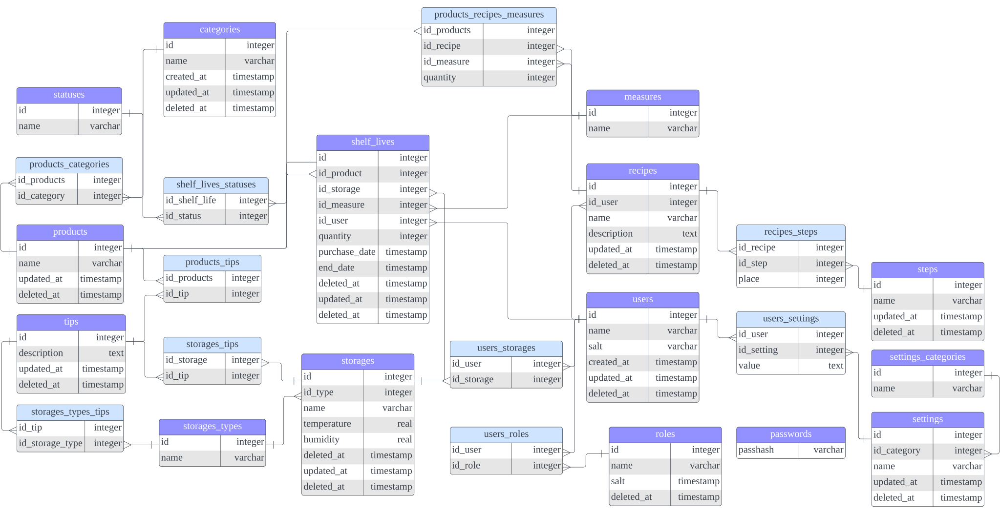

# Muerta Database

Here is the Dockefile database image for the [Muerta API](https://github.com/romankravchuk/muerta), as well as the schema of that database.

## Schema



## How to use

First: pull the docker image from the Hub

```bash
$ docker image pull ak1m1tsu/muerta-db:latest
```

Second: run docker image

```bash
$ docker run -e POSTGRES_PASSWORD=secrect -e POSTGRES_USER=postgres <other options> ak1m1tsu/muerta-db
```
